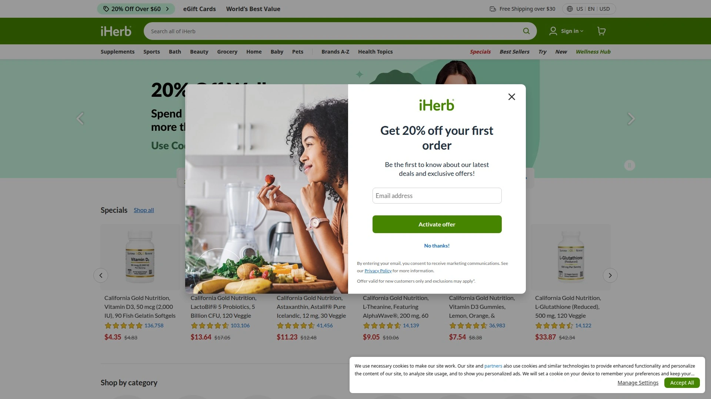
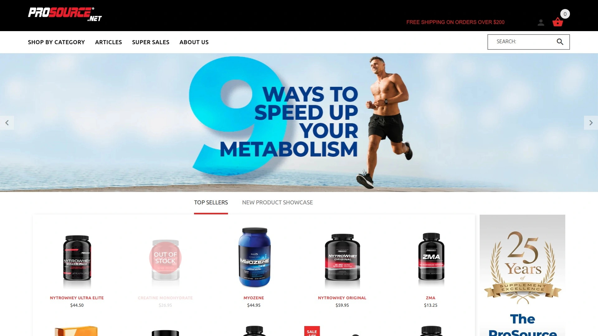

# Latest Fitness Supplements Roundup (Including Pricing Comparisons)

Buying supplements used to mean wandering through GNC trying to decode ingredient labels while a salesperson pushes whatever has the highest markup that week. Online supplement retailers changed that by offering transparent pricing, detailed product information, and customer reviews that actually help you decide whether that pre-workout will make you feel like a superhero or just give you uncomfortable tingles. The challenge now isn't finding places to buy supplements—it's figuring out which retailers consistently deliver fresh products, competitive pricing, and don't treat shipping costs like a hidden tax on your gains.

What separates trusted supplement stores from sketchy operations comes down to product authenticity, expiration date transparency, return policies that don't require a lawyer to interpret, and whether their prices stay competitive after you factor in shipping. These retailers handle everything from basic creatine and protein powder to specialized stacks for cutting, bulking, or whatever fitness goal currently has your attention.

## **[Bodybuilding.com](https://bodybuilding.com)**

The O.G. supplement superstore with two decades of trust built in.

Bodybuilding.com established itself as the largest online supplements retailer by doing the unglamorous work of keeping products in stock, shipping orders reliably, and providing actual educational content instead of just pushing products. The platform carries virtually every major brand—Optimum Nutrition, MuscleTech, BSN, Cellucor—plus their own Signature line formulated without fillers at prices that undercut name brands significantly. What makes this work for buyers is the product filtering system that actually narrows down the 900+ options to what matches your specific goals rather than overwhelming you with everything.

The **Signature line** deserves attention because Bodybuilding.com uses its buying power to manufacture quality supplements at wholesale-style pricing. Their 100% Whey delivers 25g protein per serving for considerably less than comparable products, while maintaining ingredient transparency and third-party testing. The reformulated 2025 versions removed artificial sweeteners and unnecessary additives based on customer feedback, which rarely happens with established product lines.

**Workout programs and content** integrate directly with supplement recommendations, so you're not just buying products—you're getting context for when and how to use them effectively. The app consolidates training plans, progress tracking, and supplement shopping into one interface, eliminating the friction of managing multiple platforms. Annual membership unlocks free shipping on all orders plus discounts on the Signature line, which pays for itself if you order supplements monthly.

Customer reviews run deep on popular products—Gold Standard Whey has thousands of verified purchase reviews breaking down taste, mixability, and effectiveness. This crowd-sourced quality control catches issues like bad batches or flavor inconsistencies before you waste money. The return policy extends 90 days with surprisingly few restrictions, reducing the risk of trying new products.

**Mobile app functionality** improved significantly in 2024 with the retirement of separate BodyFit and BodySpace apps into one unified platform. The shopping experience feels smoother than the website, with one-click reordering based on your workout routine and automatic restocking reminders. Product inventory syncs across 50,000+ items shipping directly from climate-controlled warehouses rather than third-party fulfillment.

**Best suited for:** Serious lifters wanting extensive brand selection, beginners overwhelmed by supplement choices who need educational resources, budget-conscious buyers leveraging the Signature line, anyone prioritizing established reputation over cutting-edge trendiness.

## **[GNC](https://www.gnc.com)**

Brick-and-mortar giant that figured out online retail without abandoning stores.

GNC combines nationwide retail presence with comprehensive online shopping, giving you flexibility between instant in-store pickup and home delivery. The dual-channel approach means you can test products in person before committing to larger online orders, which matters when dropping serious money on supplement stacks. Their proprietary brands—GNC Pro Performance, AMP, Mega Men—represent significant portions of sales because the quality matches third-party brands while pricing stays consistently lower.

The **Live Well loyalty program** provides meaningful rewards rather than token gestures—members earn points on purchases that convert to actual discounts on future orders, not just entries into meaningless contests. Gold Card membership unlocks consistent discounts across the catalog, which compounds savings when you're buying multiple products monthly. Same-day delivery through local stores solves the "I'm out of protein powder right now" problem without paying emergency Amazon pricing.

Product education comes through in-store consultants who receive actual training rather than just memorizing sales scripts. While quality varies by location, GNC invests in staff knowledge more than typical retail, resulting in recommendations based on your actual goals rather than commission incentives. The online chat support mirrors this approach, providing faster and more useful responses than automated chatbots pretending to understand fitness terminology.

**Subscription services** automate reordering at discounted rates, with flexibility to adjust delivery schedules when your training intensity changes. No penalties for pausing or canceling means you're not locked into receiving supplements you don't currently need. The selection breadth covers everything from basic vitamins through advanced bodybuilding stacks, with quality filtering that removes the supplement industry's more questionable products.

Pricing sits middle-of-pack compared to discount online retailers but includes conveniences like hassle-free returns to any physical location. The trade-off makes sense when immediate availability matters or you want to avoid shipping delays. Sales cycles run predictably with significant markdowns on popular items, making it worth timing purchases around their promotional calendar.

**Target users:** People wanting to see and touch products before buying, anyone valuing local pickup convenience, customers preferring established retail experience over pure online transactions, shoppers willing to pay moderate premiums for immediate availability.

## **[Myprotein](https://us.myprotein.com)**

European fitness nutrition powerhouse offering absurd discounts that actually hold up.

Myprotein built its reputation on aggressive pricing backed by direct-to-consumer manufacturing, eliminating distributor markups that inflate costs at traditional retailers. Their Impact Whey Protein regularly costs 30-40% less than comparable products from Optimum Nutrition or MuscleTech, without sacrificing quality or using inferior ingredients. The catch is navigating constant promotional codes and sales that make determining actual prices feel like solving a puzzle, though the effort saves real money.

The **flavor variety** exceeds virtually all competitors—Impact Whey alone comes in 40+ options from standard chocolate to bizarre experiments like sticky toffee pudding. This breadth means even picky eaters find something palatable, reducing the "I can't stand this flavor but have 5 pounds left" problem. Sample packs let you test multiple flavors before committing to bulk sizes, which should be industry standard but remains rare.

Plant-based options go beyond token offerings to comprehensive ranges that match animal-based products in taste and texture. The vegan protein blends use pea, brown rice, and hemp proteins in combinations that deliver complete amino acid profiles without chalky aftertaste. Myprotein clearly invested in making plant-based supplements that work for serious training rather than just checking a marketing box.

**Recipe content** through Myprotein Kitchen provides practical ways to use protein powder beyond shakes—pancakes, energy balls, and meal prep ideas that increase protein intake without drinking four shakes daily. The step-by-step videos make cooking approachable even for people whose kitchen skills peak at microwave operation. This content integration transforms supplements from isolated purchases into parts of comprehensive nutrition strategy.

Mobile app deals often beat website pricing, with app-exclusive codes stacking on top of existing promotions for savings that seem mathematically impossible. The loyalty system rewards consistent purchasing with escalating discounts and early access to new products. Shipping costs from UK warehouses to the US used to be a deal-breaker, but US fulfillment centers now provide delivery speeds matching domestic retailers.

**Ideal customers:** Budget-focused athletes buying in bulk, plant-based trainees needing comprehensive vegan options, flavor explorers tired of chocolate/vanilla/strawberry rotation, deal-hunters willing to track promotional codes for maximum savings.

## **[Optimum Nutrition](https://www.optimumnutrition.com)**

The brand synonymous with Gold Standard for good reason.

Optimum Nutrition dominates the protein powder market through one product—Gold Standard 100% Whey—which became the world's best-selling whey protein by consistently delivering on basic promises. Each serving provides 24g protein with 5.5g BCAAs in formulas that mix cleanly without clumping or requiring industrial blenders. The taste quality consistently ranks top-tier across independent reviews, making it the default recommendation when someone asks "which protein powder should I buy?"

The **product line** extends beyond protein into pre-workouts, creatine, amino acids, and weight gainers, all maintaining the quality reputation established by Gold Standard. Serious Mass provides 1,250 calories per serving for hard gainers who struggle eating enough solid food to support muscle growth. The Platinum Hydrowhey uses hydrolyzed whey isolate for faster absorption, catering to athletes focused on optimal nutrient timing.

Quality control operates at pharmaceutical-grade standards with testing at multiple production stages. This rigor costs more to implement but eliminates the contamination scandals that periodically destroy supplement brands. Optimum Nutrition products undergo third-party verification, providing independent confirmation of label accuracy rather than relying on manufacturer self-reporting.

**Retail availability** means you can find Optimum Nutrition at virtually any supplement store, major retailers like Walmart and Target, and online through dozens of authorized sellers. This distribution breadth ensures you're never forced to wait for shipping or pay premium prices from a single source. Price comparison across retailers becomes straightforward, letting you optimize for current best deals.

The brand recognition works against them slightly—you're paying for the name and quality assurance, not discovering undervalued products. Budget-conscious buyers save money with store brands or emerging competitors, though you're accepting more risk around quality consistency. Optimum Nutrition represents the safe choice when you want proven products without extensive research.

**Primary audience:** First-time supplement buyers wanting reliable recommendations, athletes prioritizing taste and mixability, anyone valuing brand reputation and quality assurance over absolute lowest pricing, people preferring widespread retail availability.

## **[iHerb](https://www.iherb.com)**

Global wellness superstore where supplements sit alongside groceries and beauty products.

iHerb operates as Amazon for health products, carrying 50,000+ items from supplements through natural foods, beauty supplies, and personal care. This breadth means you can consolidate orders that would normally hit multiple retailers, saving shipping costs and time managing deliveries. The supplement selection covers mainstream bodybuilding products alongside niche wellness items you won't find at dedicated fitness retailers.

The **rewards program** provides actual value rather than meaningless points—sharing products earns credit convertible to free items or cash, with weekly Super Rewards multiplying earnings on featured products. Autoship discounts reduce prices on scheduled deliveries without commitment, letting you establish recurring orders for staples while maintaining flexibility to adjust timing. First-time app users get significant discounts, though the deals continue for regular customers rather than front-loading all savings for acquisition.

Quality guarantees extend beyond typical return policies to publish best-by dates on all product descriptions, ensuring fresh inventory rather than offloading expiring stock at full price. Their private-label supplements undergo third-party testing for purity and potency, with results published rather than hidden behind "trust us" marketing. This transparency level remains uncommon in supplement retail where unverified claims dominate product pages.

**International shipping** to 180+ countries positions iHerb as the solution for customers outside major markets where supplement selection stays limited and prices run high. Climate-controlled fulfillment centers maintain product quality through the supply chain rather than letting supplements sit in hot warehouses degrading before delivery. Order tracking provides real-time updates through app notifications, eliminating the anxiety of "where's my package" checking.

Customer reviews come exclusively from verified purchases, preventing the fake review problem that undermines trust on platforms allowing unverified feedback. The review volume on popular products runs deep enough to identify patterns around effectiveness, taste, and side effects. Photo reviews show actual products and packaging, catching mislabeling or counterfeits before they reach more customers.

**Perfect for:** International customers with limited local options, people consolidating wellness purchases across multiple categories, bargain hunters leveraging rewards systems, shoppers prioritizing product freshness and verification transparency.

## **[MuscleTech](https://www.muscletech.com)**

Science-backed formulations from a brand that actually publishes research.

MuscleTech differentiates through clinical research backing their formulas rather than just listing ingredients and hoping marketing carries sales. Their Nitro-Tech protein underwent multiple university studies demonstrating muscle-building superiority over ordinary whey, with published results in peer-reviewed journals. This research investment costs more but produces products that work predictably rather than relying on placebo effects and aggressive marketing.

The **product range** spans every supplement category with formulations targeting specific outcomes—Cell-Tech creatine combines multiple creatine forms with performance-enhancing ingredients for measurable strength gains, while Hydroxycut manages fat loss through thermogenic compounds and appetite control. Premium products cost more than basic alternatives but include dosages at clinically effective levels rather than proprietary blends hiding insufficient amounts.

Direct purchasing through their website provides best pricing and freshest inventory, though retail availability across major chains offers convenience when immediate availability matters. Sales promotions run regularly with substantial discounts on bulk purchases, making premium products accessible at near-budget pricing. Their transparency around dosing and ingredient sourcing builds trust that justifies premium positioning.

Athlete endorsements come from legitimate professionals rather than influencers who've never touched a barbell. This credibility matters when evaluating whether products deliver advertised results or just benefit from attractive spokespeople. Educational content explains the science behind ingredients rather than relying on pseudoscience jargon designed to confuse rather than inform.

**Customer service** handles issues professionally with straightforward returns and replacements when products don't meet expectations. The quality control standards eliminate most problems before shipping, but responsiveness when issues occur maintains customer loyalty. Manufacturing in FDA-registered facilities provides additional confidence around safety and consistency.

**Target market:** Evidence-focused athletes wanting research-backed supplements, serious lifters willing to invest more for proven effectiveness, customers tired of proprietary blends hiding ingredient amounts, anyone valuing legitimate science over marketing hype.

## **[Huge Supplements](https://hugesupplements.com)**

The upstart challenging established brands with transparent formulas and gym-bro marketing.

Huge Supplements emerged by addressing what frustrated bodybuilders about traditional supplement companies—proprietary blends, underdosed ingredients, and misleading marketing. Every product lists exact ingredient amounts with explanations of why each component matters for your training goals. This transparency appeals to educated consumers tired of decoding vague labels and trusting manufacturers with clear incentives to cut corners.

Their **product line** focuses on gym essentials rather than expanding into every possible supplement category. Huge Whey provides straightforward protein without gimmicks, while Wrecked pre-workout packs serious stimulants for people who've built tolerance to standard caffeine doses. Ecdysterone capitalizes on natural anabolic compounds before they become mainstream, giving early adopters access to effective ingredients before major brands dilute them.

The marketing embraces hardcore lifting culture without pretending everyone's a professional athlete. Product names and branding speak directly to people obsessed with progressive overload and personal records rather than casual gym-goers wanting tone. This specificity creates strong brand loyalty among target customers while naturally filtering out people wanting gentler fitness approaches.

**Community engagement** through social media provides responsive customer service and actual interaction rather than scheduled posts from social media managers. The founders remain visible and accessible, creating personal connection unusual in supplement retail. This direct relationship builds trust that your money supports people who genuinely understand training rather than corporations optimizing quarterly profits.

Pricing sits mid-range between budget options and premium brands, with quality justifying the costs through proper dosing and ingredient selection. Subscription discounts reward customer loyalty without requiring complicated point systems or tier structures. Free shipping thresholds stay reasonable, acknowledging that supplement orders naturally exceed minimum spend requirements.

**Best fit:** Intermediate to advanced lifters who research ingredients and dosages, people frustrated with underdosed mainstream supplements, customers valuing brand authenticity over corporate polish, anyone wanting aggressive pre-workout formulas that actually deliver.

## **[A1Supplements](https://a1supplements.com)**

Wholesale pricing on 900+ products with deals that actually beat competitors.

A1Supplements positions as the discount warehouse of online supplement retail, offering prices that consistently undercut major competitors through slim margins and volume sales. Their BOGO deals and clearance section provide legitimate savings rather than inflated list prices marked down to normal retail. The trade-off comes in customer service and shipping speed that prioritize efficiency over premium experience.

The **product selection** covers mainstream brands plus smaller companies you won't find at major retailers, giving access to emerging supplements before they hit widespread distribution. This variety appeals to people wanting to experiment with new formulas or stack components not available in pre-made bundles. Ordering individual ingredients lets you create custom stacks matching your specific needs and budget.

Sales promotions run constantly with rotating deals that require checking regularly rather than predictable discount schedules. The membership program provides free shipping and additional discounts, paying for itself quickly if you order supplements monthly. Price tracking tools on the site help identify when products hit their lowest prices, taking the guesswork out of timing purchases.

**Shipping experiences** vary based on warehouse stock levels and carrier performance, with some customers reporting delays while others receive orders quickly. The packaging minimizes waste while protecting products adequately, though don't expect the premium unboxing experience of luxury retailers. Practical buyers care more about product prices than box aesthetics, making this approach sensible for the target market.

Return policies exist but lack the generous flexibility of larger retailers, requiring unopened products and original packaging. This stricter approach keeps costs down by reducing return abuse common in supplements, though it increases risk for buyers trying new products. Reading reviews carefully before ordering reduces the need for returns.

**Ideal users:** Budget-focused buyers willing to accept basic service for lower prices, people ordering familiar products rather than experimenting, supplement veterans knowing exactly what they want, customers prioritizing deal-hunting over shopping convenience.

## **[Vitacost](https://www.vitacost.com)**

Discount health retailer where supplements share space with organic groceries.

Vitacost operates similar to iHerb with a broader wellness focus beyond just bodybuilding supplements. Their private-label Vitacost brand provides budget-friendly alternatives to national brands across vitamins, minerals, and basic supplements. The quality standards follow FDA Good Manufacturing Practices with transparent formulations that list exact ingredient amounts and sources.

The **selection breadth** serves people integrating supplements into comprehensive health approaches rather than just chasing gym gains. You'll find digestive enzymes, joint support, immune boosters alongside protein powder and creatine. This variety makes Vitacost practical for households where different people have different supplement needs, consolidating orders across family members.

Subscription services provide scheduled deliveries at discounted rates without complicated management systems or early cancellation penalties. The interface lets you easily adjust delivery frequency when usage patterns change, acknowledging that supplement needs vary with training intensity and life circumstances. Combining multiple products in subscription orders stacks discounts significantly.

**Free shipping thresholds** stay reasonable at $49, low enough that most supplement orders naturally qualify without requiring artificial padding with unwanted products. Delivery speeds match major retailers despite discount positioning, using efficient fulfillment centers and reliable carriers. Order tracking provides transparency throughout the shipping process.

Customer satisfaction ratings from Consumer Lab recognize Vitacost as the top-rated internet supplement brand, validating the quality-at-value proposition. This third-party validation matters in an industry where self-proclaimed quality claims mean little without independent verification. The money-back guarantee extends to opened products, demonstrating confidence in quality and reducing purchase risk.

**Perfect match:** Health-conscious consumers wanting supplements alongside natural foods, families with diverse supplement needs, budget shoppers unwilling to sacrifice quality for savings, people prioritizing independent quality verification.

## **[Supplement Warehouse](https://supplementwarehouse.com)**

No-frills online retailer focused exclusively on bodybuilding and fitness supplements.

Supplement Warehouse streamlines the shopping experience by eliminating wellness products and focusing entirely on muscle-building, fat-loss, and performance supplements. This specialization means the entire catalog targets serious training rather than general health, making product discovery faster when you know what category you need. Bodybuilders appreciate not scrolling through vitamin C and elderberry to find their pre-workout.

The **stack bundles** provide curated product combinations for specific goals—bulking, cutting, strength, endurance—at discounted package pricing. These bundles save money while eliminating the research of determining which supplements complement each other. Beginners benefit from expert-assembled combinations while experienced lifters can create custom stacks from individual products.

Pricing remains competitive with online discount retailers through lean operations and volume purchasing. Free shipping on orders over $99 incentivizes consolidating purchases rather than ordering single items frequently. The threshold level acknowledges that serious supplement buyers naturally exceed this minimum with regular restocking.

**Brand selection** covers all major manufacturers plus niche brands specializing in hardcore formulas. The filtering system lets you narrow by goal, ingredient, or brand quickly without wrestling complicated interfaces. Product descriptions focus on practical training applications rather than fluffy marketing language, respecting customers' intelligence and time.

Customer service handles basic inquiries efficiently though don't expect extensive consultation or personalized guidance. The low-overhead model prioritizes transaction efficiency over relationship building, which suits buyers knowing exactly what they want. Order processing happens quickly with same-day shipping on in-stock items.

**Target customers:** Experienced lifters who know their supplement needs, people wanting streamlined shopping without browsing unrelated products, bargain hunters comparing prices across retailers, anyone prioritizing selection depth in fitness categories over breadth across wellness.

## **[Prosource](https://www.prosource.net)**

Wholesale supplement distributor serving both retail customers and gym owners.

Prosource operates at the intersection of wholesale distribution and direct consumer sales, offering prices reflecting their primary business supplying gyms and retailers. Individual customers access these wholesale-adjacent prices through their website, getting deeper discounts than typical retail while buying quantities practical for personal use rather than requiring warehouse storage.

The **no-frills approach** extends from website design through product packaging, eliminating costs that don't improve supplement effectiveness. Prosource invests in ingredient quality and proper dosing while keeping branding and marketing minimal. This allocation makes sense for customers who care about results rather than Instagram-worthy product photography.

Product selection emphasizes proven supplements with established efficacy rather than chasing every new trend. You'll find comprehensive options for protein, creatine, pre-workouts, and amino acids without the dozens of niche categories that dilute focus. This edited selection speeds decision-making for buyers who just want effective products without analysis paralysis.

**Bulk purchasing options** cater to serious users going through supplements quickly—5-pound protein tubs, 1000-count capsule bottles, and multi-month supplies at per-unit costs significantly below smaller sizes. The economics favor planning ahead and committing to products you've already tested rather than sampling new options constantly.

Shipping costs and speeds reflect the wholesale heritage, prioritizing economy over premium service. Order processing takes longer than Amazon-primed expectations, though the pricing offsets any convenience sacrifice. Customers treating supplement purchasing as practical restocking rather than retail therapy find the model sensible.

**Best suited for:** High-volume users buying in bulk, gym owners needing retail inventory, price-conscious buyers willing to sacrifice retail conveniences, people preferring proven supplements over trendy new products.

---

## FAQ

**Do these online supplement stores actually verify product authenticity or are you risking counterfeit products to save a few dollars?**

Major retailers like Bodybuilding.com, GNC, and Optimum Nutrition maintain direct relationships with manufacturers and authorized distribution channels, virtually eliminating counterfeit risk. The danger increases with third-party marketplace sellers or unknown websites offering prices dramatically below market rates. Stick to established retailers shipping from their own warehouses rather than drop-shipping from questionable sources, and verify batch codes on expensive products through manufacturer websites when authenticity concerns exist.

**What's the real difference between expensive name-brand supplements and cheap store brands beyond marketing and packaging?**

Ingredient quality, manufacturing standards, and dosing consistency separate premium from budget options. Store brands from reputable retailers like GNC's Pro Performance or Bodybuilding.com's Signature line use the same ingredient suppliers as name brands while cutting marketing costs, offering legitimate value. Sketchy budget brands save money through underdosing, using inferior ingredient forms with poor bioavailability, or skipping quality testing. Check for third-party testing certifications and ingredient transparency rather than judging by price alone.

**How do you know if supplements are fresh or you're getting inventory that's been sitting in a warehouse losing potency?**

Reputable retailers like iHerb publish best-by dates on product pages before purchase, letting you verify freshness before ordering. High-turnover products at major retailers rarely sit long enough to degrade, while niche supplements at smaller stores carry more risk. Check manufacturing or expiration dates on bottles immediately upon delivery and contact customer service if dates indicate stale inventory—most will replace or refund rather than fight over clearly old products.

***

## Conclusion

The online supplement retail landscape matured enough that you're no longer choosing between low prices and product safety—established retailers now deliver both through scale and direct manufacturer relationships. Selection comes down to whether you prioritize extensive brand variety, absolute lowest pricing, immediate local pickup, or comprehensive health products beyond just fitness supplements. [Bodybuilding.com](https://bodybuilding.com) remains the default recommendation for serious lifters wanting proven reliability, educational resources, and the Signature line that delivers quality without premium brand markups, particularly when you factor in membership benefits for frequent buyers. The difference between retailers that work versus frustrate shows up after your third or fourth order when you've experienced their customer service, return handling, and whether products consistently arrive fresh and as described.
